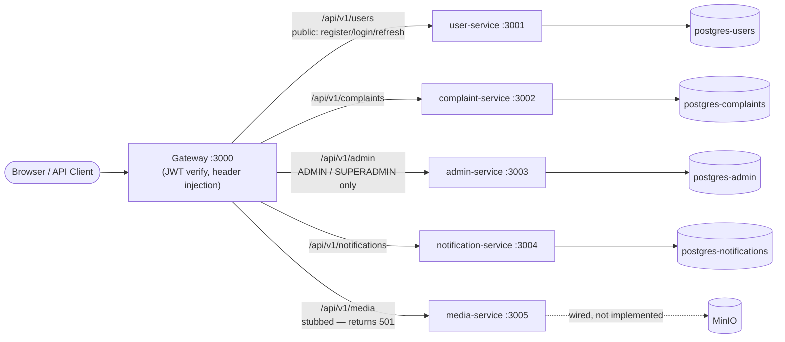
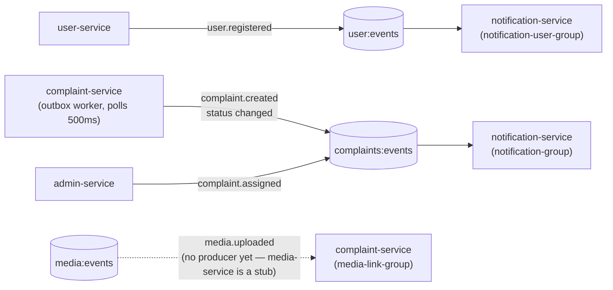
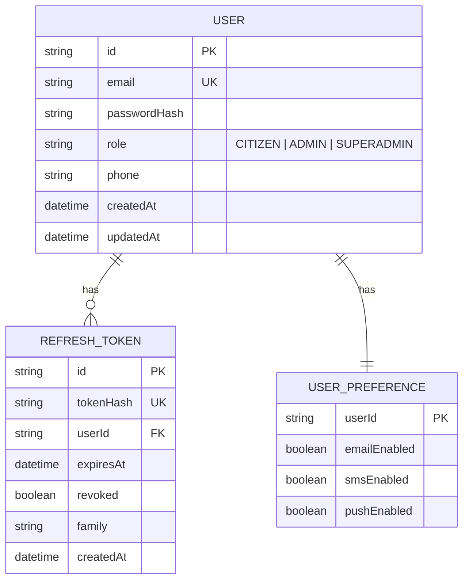
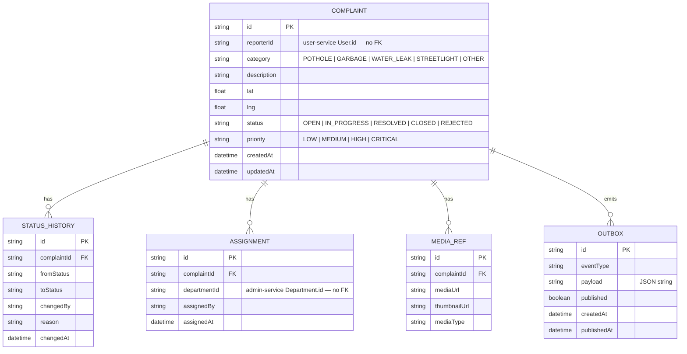
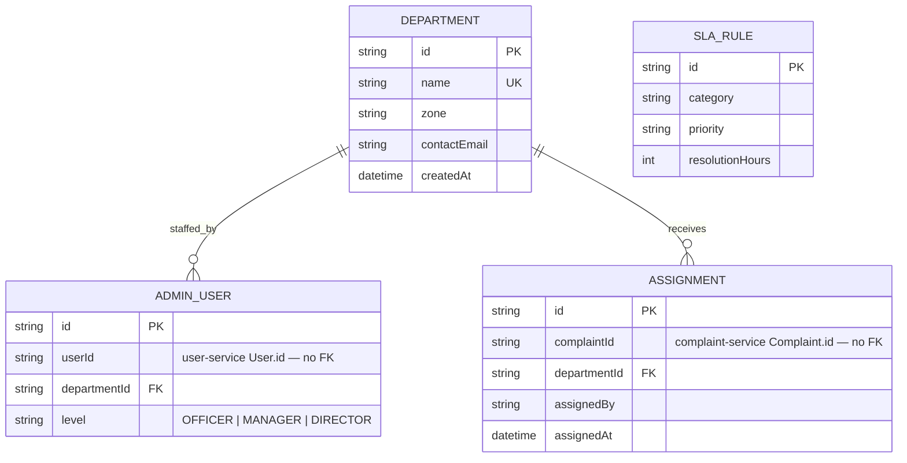
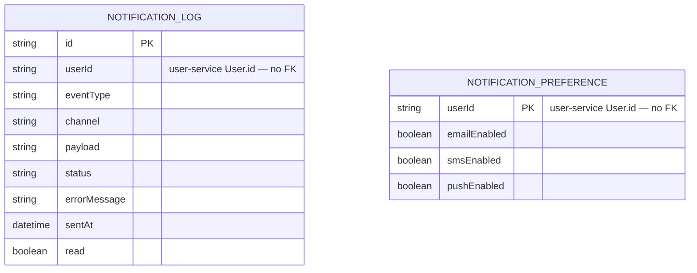

<div align="center">

# CivicPulse

**A microservices-based civic complaint and infrastructure resolution platform.**

CivicPulse models the full lifecycle of a municipal complaint system — citizens report civic issues (potholes, water leaks, streetlight failures), the platform routes them through department assignment, tracks SLA compliance, and notifies citizens as status changes. Built as five independently deployable Node.js services behind a single API gateway, with Redis Streams driving async workflows and per-service PostgreSQL databases enforcing domain isolation.

[](https://expressjs.com/)
[](https://www.typescriptlang.org/)
[](https://www.postgresql.org/)
[](https://redis.io/)
[](https://www.docker.com/)
[](https://react.dev/)
[](LICENSE)

</div>

---

## Table of Contents

- [Problem Statement](#problem-statement)
- [Architecture](#architecture)
- [Database Design](#database-design)
- [Features](#features)
- [Tech Stack](#tech-stack)
- [Repository Structure](#repository-structure)
- [Getting Started](#getting-started)
- [Environment Variables](#environment-variables)
- [Running the Services](#running-the-services)
- [API Reference](#api-reference)
- [Known Limitations](#known-limitations)
- [License](#license)

---

## Problem Statement

Civic complaint handling in most municipalities is fragmented across phone calls, paper forms, or apps with no visibility into resolution status. CivicPulse addresses this with a structured pipeline:

- **Citizens** submit complaints with category, geolocation, and priority, and track status in real time.
- **Departments** receive assignments and are held against SLA rules keyed by category and priority.
- **Administrators** get a dashboard view of open/in-progress/resolved counts and active SLA violations.

The domain model enforces a strict complaint lifecycle state machine (`OPEN → IN_PROGRESS → RESOLVED → CLOSED`, with `REJECTED` as an early exit), and every transition is persisted to a status history table for auditability.

## Architecture

A single public entry point (the gateway) fronts five isolated backend services, each owning its own database. The gateway is the only trust boundary: it verifies the JWT, strips the raw `Authorization` header, and injects trusted internal headers (`x-user-id`, `x-user-role`, `x-internal-service`) before proxying — downstream services never see a raw token, they just check that the request came from the gateway.



Async work is decoupled from the write path via Redis Streams, using a consumer-group model with idempotency keys and stale-message reclaim (`XAUTOCLAIM`). Complaint events are published through a transactional **outbox** table, so event delivery can never drift from what was actually committed to the database.



**Key design decisions:**

| Decision | Why |
|---|---|
| Gateway strips raw `Authorization` header, injects trusted internal headers | Downstream services never see raw JWTs — trust boundary sits at the gateway |
| Outbox pattern for complaint events | Guarantees event publication is consistent with the DB write, not a separate fire-and-forget call |
| Redis-backed JWT ID revocation + hashed refresh token rotation | Access tokens are revocable server-side; refresh tokens are never stored in plaintext |
| Per-service database | No service can bypass another's domain boundary at the data layer |

## Database Design

Each service owns its schema outright — there are **no cross-database foreign keys**. Services that need to reference another service's entity (e.g. a complaint's `reporterId`, an assignment's `departmentId`) store the ID as a plain string and resolve it via API calls, not a DB-level join. This is the standard database-per-service trade-off: strong domain isolation in exchange for giving up referential integrity across boundaries.

<details>
<summary><strong>user-service</strong> — auth, sessions, notification preferences</summary>


</details>

<details>
<summary><strong>complaint-service</strong> — complaint lifecycle, status history, outbox</summary>


</details>

<details>
<summary><strong>admin-service</strong> — departments, staffing, assignment, SLA rules</summary>



Note: `Assignment` exists in **both** complaint-service and admin-service — each service keeps its own record of the same real-world fact for its own querying needs, correlated by `complaintId`/`departmentId` rather than a shared table.
</details>

<details>
<summary><strong>notification-service</strong> — notification log, delivery preferences</summary>


</details>

## Features

- **Auth** — register/login/refresh/logout, bcrypt password hashing, JWT access tokens with Redis-backed revocation, HTTP-only rotating refresh-token cookies, role-based access (`CITIZEN`, `ADMIN`, `SUPERADMIN`)
- **Complaints** — creation with geolocation, category, and priority; filtered/paginated listing; per-user history; state-machine-guarded status transitions; Redis-cached reads with invalidation on write
- **Admin** — department CRUD, complaint assignment (validated against complaint-service), dashboard summary, SLA violation detection by comparing assignment age to category/priority SLA rules
- **Notifications** — event-driven consumption of `user:events` and `complaints:events`, in-app notification log, email via `nodemailer` (Ethereal test accounts outside production), SMS as a console stub, per-user preference management
- **Media** — service scaffolded with health/readiness checks and MinIO wired in docker-compose; upload routes not yet implemented (see [Known Limitations](#known-limitations))
- **Frontend** — React + Vite SPA covering citizen and admin flows: login/register, complaint list/detail/form, admin dashboard, SLA violations view

## Tech Stack

| Layer | Technology |
|---|---|
| Frontend | React 19, Vite 5, TypeScript, React Router, TanStack Query, Zustand, Tailwind CSS |
| Backend | Node.js, Express 4, TypeScript, Zod |
| Data | PostgreSQL 15, Prisma 5 |
| Messaging / Cache | Redis 7, Redis Streams, ioredis |
| Auth | jsonwebtoken, bcrypt |
| Infra | Docker, Docker Compose, MinIO, Adminer |
| Monorepo | npm workspaces + Turborepo |

## Repository Structure

```text
apps/
  gateway/               API gateway — routing, auth enforcement, proxying
  user-service/          Auth, JWT/refresh-token handling, user profiles
  complaint-service/     Complaint lifecycle, status history, outbox
  admin-service/         Departments, assignment, dashboard, SLA detection
  notification-service/  Notification logs, preferences, stream consumers
  media-service/         Health/readiness only — routes stubbed
  web/                   Vite + React frontend

packages/
  shared-types/          Shared enums, Zod schemas, API/event contracts
  shared-middleware/     Logging, error handling, validation middleware
  shared-redis/          Redis client and stream helpers
  ui/                    Shared React UI components
  eslint-config/ typescript-config/   Shared tooling config

infra/docker/            Per-service Dockerfiles
scripts/                 Seed data, smoke tests
docker-compose.yml       Full local stack (Postgres x4, Redis, MinIO, Adminer, all services)
```

## Getting Started

### Prerequisites

- Node.js (npm `10.9.4`, per root `packageManager`)
- Docker + Docker Compose

### Setup

```bash
git clone https://github.com/palsoniii/Civic-Pulse.git
cd Civic-Pulse
npm install
docker compose up --build
```

This starts all four Postgres instances, Redis, MinIO, Adminer, all five backend services, the gateway, and the web app. Gateway on `:3000`, web on `:5173`, Adminer on `:8080`.

## Environment Variables

Each service reads its own `.env`; see the corresponding `.env.example` in each `apps/<service>` directory, or the root `.env.example` used by Docker Compose. Consolidated required variables:

| Service | Required | Notes |
|---|---|---|
| gateway | `REDIS_URL`, `JWT_SECRET` (≥16 chars), `USER_SERVICE_URL`, `COMPLAINT_SERVICE_URL`, `ADMIN_SERVICE_URL`, `NOTIFICATION_SERVICE_URL`, `MEDIA_SERVICE_URL` | `PORT` defaults `3000`, `ALLOWED_ORIGINS` defaults `http://localhost:5173` |
| user-service | `DATABASE_URL`, `REDIS_URL`, `JWT_SECRET` (≥16 chars) | `JWT_EXPIRY` defaults `15m` |
| complaint-service | `DATABASE_URL`, `REDIS_URL` | `PORT` defaults `3002` |
| admin-service | `DATABASE_URL`, `REDIS_URL`, `COMPLAINT_SERVICE_URL` | `PORT` defaults `3003` |
| notification-service | `DATABASE_URL`, `REDIS_URL` | SMTP vars default to Ethereal test config |
| media-service | `REDIS_URL` | `PORT` defaults `3005` |

All services default `LOG_LEVEL=info` and `NODE_ENV=development` if unset.

## Running the Services

```bash
# Everything, via Turborepo
npm run dev

# One service
npm run dev --workspace=<workspace-name>

# Build / lint / test
npm run build
npm run lint
npm run test
npm run test:integration   # runs scripts/smoke-test.sh
```

Services with Prisma schemas (`user-service`, `complaint-service`, `admin-service`, `notification-service`) also expose:

```bash
npm run prisma:generate --workspace=<workspace-name>
npm run prisma:migrate --workspace=<workspace-name>
npm run db:seed --workspace=apps/admin-service       # and complaint-service
```

## API Reference

No OpenAPI/Swagger generation is currently wired in. Gateway route surface:

| Method | Path | Access |
|---|---|---|
| `GET` | `/health`, `/ready` | Gateway self-check |
| `*` | `/api/v1/users/*` | `register`/`login`/`refresh` public, rest authenticated |
| `*` | `/api/v1/complaints/*` | Authenticated |
| `*` | `/api/v1/admin/*` | `ADMIN` / `SUPERADMIN` only |
| `*` | `/api/v1/notifications/*` | Authenticated |
| `*` | `/api/v1/media/*` | Authenticated (stubbed — returns `501`) |

Full per-service route lists (individual endpoints for complaint status updates, department CRUD, SLA violation queries, notification preferences, etc.) are documented in each service's route files under `apps/<service>/src/routes`.

## Known Limitations

Being direct about this rather than leaving it implicit:

- **No automated test suite yet** — service `test` scripts are placeholders; `shared-types` runs lint as its test. Integration coverage exists only via `scripts/smoke-test.sh`, and CI only runs unit tests for `user-service`, `complaint-service`, and `shared-types`.
- **No OpenAPI/Swagger docs** — route contracts are readable from source but not machine-generated yet.
- **`media-service` is scaffolded, not implemented** — health/readiness endpoints work, upload routes return `501`, and the `media:events` stream has a consumer (complaint-service) but no producer yet.
- **SMS notifications are a stub** — `notification-service` logs the outgoing message to the console instead of calling a real provider (Twilio env vars are present but unused).

## License

This project is licensed under the [MIT License](LICENSE).
